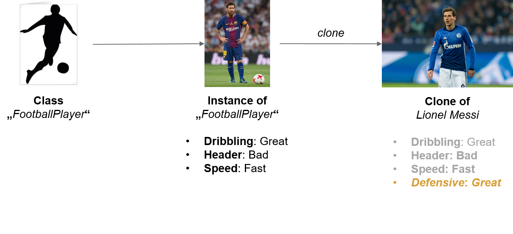

<h1><strong>Implementing Properties</h1></strong><p>

<p>The blog summarizes the main essence of Implementing Properties , the usage of the Property Pattern and is based on the main thoughts of Steve Yegge and Martin Fowler. In the first part the blog shortly explains the meaning of the Property Pattern and lists up some different synonyms of it. After that different forms of fixed and dynamic properties are introduced and explained by showing some short code examples. In the third part of the blog, the implementing of the Property Pattern will be explained. Finally further known applications and some conclusions will be listed. </p>

<h2><strong> 1) What is a Property?</strong></h2> 

<p>There are a lot of different definitions of the term "Property" all around the world. The term "Property" has a lot of meanings. On the one hand people define the term "Property" as an instance variable or data member of a class, on the other hand it is only a further information which is going in a box in a UML diagram. This blog will focus on the two definitions by Martin Fowler and Steve Yegge. <p>

<p>Martin Fowler explains the term "Property" as some information about an object that can be obtained by a query-method or updated by a modifier-method. In his purpose properties may be value types such as in Java or instances of classes. Furthermore clients have the possibilities of using modifier-methods, like the set-method at the beginning point of creating an object or also the storing of a property as an instance variable or data member. Classes are able to get the value from other classes or getting them by going through some calculations. All these possiblities are optional ways of implementation and not necessarily at all. In Martin Fowler`s opinion the interface view is much more important then the implemention view of properties. In his mind, the essence of object-orientation is a strictly separation of interfaces from implementation. He is putting the focus on the main difference between using fixed properties and dynamic properties.<p>

<p>Steve Yegge is representing a different view of properties. In his opinion the properties are a very grateful tool of domain modeling with its own unique strengths and tradeoffs for programmers. He calls it the "Universal Design Pattern". He compares it to the Prototype Pattern, where the reuse of behaviour or inheritance is a main content. Furthermore he mentions other terms like "Do-it-yourself Reflection" with the focus on a Property List, Anything and a Registry and "Adaptive Object Modeling", where attributes are held as a collection of properites. There are three conceptual underpinnings of the Property Pattern:<p>
<ul>
  <li>
    <p>Classes and Instances</p>
  </li>
  <li>
    <p>The Prototype Principle</p>
  </li>
  <li>
    <p>The splitting-off of instances from classes<p>
</ul>
<p> Steve Yegge also compares the properties to other important domain modeling techniques like class modeling, relational modeling, XML modeling, functional modeling or the prolog-style logical modeling. In his mind, the property pattern is the most underrated desgin tool and he is trying to demonstrate the large opportunities of using it rightfully. He is putting is focus on implementing properties by using reasonable maps. Both point of views will be explained later on in this blog.
</p>

<h2> <strong> 2) Approaches in Property Modeling </strong></h2> <p>
<h3> <strong> 2.1) Fixed Properties versus Dynamic Properties</strong> </h3> <p>

<p> Alomost every object needs properties at the beginning of its creation. There are a lot of ways using properties, for example every soccer team may have a captain, a book may have a isbn number or a person may have a name. Martin Fowler is speaking about two fundamental differences in using the property pattern, the fixed and dynamic properties. Different kind of problems can be solved by using the right option. Most of the time with fixed properties, but there are also situations where various dynamic properties are the right solution of implementing and solving problems. The following table gives an overview of the different kinds of properties, which Martin Fowler is demonstrating: </p>


<table>
  <thead>
    <tr>
      <th>Problem</th>
      <th>Solution</th>
      <th>Name</th>
    </tr>
  </thead>
  <tbody>
    <tr>
      <td></td>
      <td>Give it a specific attribute for that fact. This will translate to a query method and probably an update method 
          in a programming language.</td>
      <td> Fixed Property </td>
    </tr>
    <tr>
      <td></td>
      <td>Provide a parameterizable attribute which can represent different properties depending on the parameter</td>
      <td>Dynamic Property</td>
    </tr>
    <tr>
      <td></td>
      <td>Provide an attribute parameterized with a string. To declare a property just use the string.</td>
      <td>Flexible Dynamic Property</td>
    </tr>
    <tr>
      <td></td>
      <td>Provide an attribute parameterized with an instance of some type. To declare a property create a new instance of 
          that type.</td>
      <td>Defined Dynamic Property</td>
    </tr>
    <tr>
      <td></td>
      <td>Provide an attribute parameterized with a instance of some type. To declare a property create a new instance of 
          the type and specify the value type of the property.</td>
      <td>Typed Dynamic Property</td>
    </tr>
    <tr>
      <td>How do you represent a fact about an object and allow facts to be recorded about that fact. </td>
      <td>Create a separate object for each property. Facts about that property can then be made properties of that 
          object.</td>
      <td>Separate Properties</td>
     </tr>
     <tr>
      <td>How do you represent a relationship between two objects? (How do you represent multi-valued dynamic properties?)
      </td>
      <td>Create a relationship object for each link between the two objects. Give the relationship object a type object 
          to indicate the meaning of the relationship. (The type object is the name of the multi-valued property.) </td>
      <td>Typed Relationship </td>
     </tr>
     <tr>
      <td>How do you enforce that certain kinds of objects have certain properties when you use dynamic properties? </td>
      <td>Create knowledge level to contain the rules of what types of objects use which types of properties.</td>
      <td>Dynamic Property Knowledge Level</td>
     </tr>
     <tr>
      <td>How do you give an object a property without changing its interface</td>
      <td>Make another object responsible for knowing about the property.</td>
      <td>Extrinsic Property</td>
  </tbody>
</table>

<h3> <strong> 2.2) The Fixed Property </strong> </h3><p>

<p> The following code block shows a classic example of using fixed properties. Fixed properties are declared in the interface of the type. You get back the return type and deliver the name. The code block below is showing a fixed property by using the example of the class Player. The class Player contains three attributes: date of birth (type: Date), age (type: int) and salary (type: int). Furthermore there is a class SoccerTeam. Every member of the class Player belongs or belongs not to the class SoccerTeam.<p>

```java
class Player {
    public Date getDateOfBirth();
    public int getAge();
    public int getSalary();
    public SoccerTeam getEmployer();
    public void setDateOfBirth (Date newDateOfBirth);
    public void setEmployer (SoccerTeam newEmployer);
}
```
   

<p> This typical implementation of fixed properties is following the so called "Get-and Set-convention"and is the most common Java-convention. It is also possible to declare it after the naming of the property (e.g. DateOfBirth) and leaving out the query or modify operator. The importance lies in following the same convention all the time whether you are using stored or derived values. The implementing of modifier operations depends on whether you claim values to be directly modified or not. At this point the so called "Set-Convention"is the most used form. Furthermore you are able to choose different return types. First, there is the possiblilty of using the new value of the property (e.g. Date). Second, there is the opportunity of using the object being modified (Player). The third way is simply to return nothing (void), which is in Martin Fowler´s opinion the best choice for creating a clear difference between the return types of modifier and query operations. Another important topic are immutable properties: A property that does not change for the lifetime of class. In this case every programmer should consider human errors during implementation time. For example is the DateOfBirth an immutable property for humans, but this doesn´t mean that a computer system is treating it the same way. So to hedge one´s bets, keeping this thought about human errors in mind may prevent implementing mistakes in your code.<p>

<p><strong> Summary:</strong></p>
<p> 
<ul>
  <li>
    <p> Fixed Properties are the most common form of properties</p>
  </li>
  <li>
    <p>Simple and convenient in using and solving most problem situations</p>
  </li>
  <li>
    <p>Possibility of using query and modifier operations</p>
  </li>
  <li>
    <p>Fixed Properties always should be the first choice of implenting properties<p>
  </li>
  <li>
    <p>Fixed Properties start to fail at a large amount of them and when frequently changing or changing during runtime is necessary</p>
  </li>
</ul>
        
<h3> <strong> 2.3) The Dynamic Property </strong> </h3> <p>

<p> Fixed Properties follow the restriction by fix them at design time. For some problem situations this decision is the false solution. In this case you are able to use Dynamic Properties. For example you are building a contact system for all the Players which belong to the SoccerTeam. Players may have fixed attributes, but also unfixed attributes like vacation address, phone number or a second home address. To implement this in advance is a complicated situation and would imply renewed compiling, testing and distribution. Thats the point where Dynamic Properties have there usage.
Dynamic Properties give a parameterizable attribute wich can be represent different properties on the parameter. There is always the possiblity to add properties at run time, but the implementation may be unclear and really complex itself. There are a lot of different variations of dynamic property implementations, which will be explained in the blog below.<p>

<p><h3> <strong> 2.4) The Flexible Dynamic Property </strong> </h3> <p>

<p>The Flexible Dynamic Property is the easiest form of implemtation. In this case you provide an attribute paramterized with a string. The Property himself is declared by just using the string.<p>

```java
class Player {
    public Object getValueOf (String key);
    public void setValueOf (String key, Object value);
    
    Messi.setValueOf ("vacationAddress", anAddress);
    Address messiVacation = (Address) messi.getValueOf ("VacationAddress");
}
```

<p> The code example shows the adding off a vacation address property to the person "Messi". A method getValueOf is implemented with a string key as parameter. The setValueOf-Method by a key-value pair with a string parameter as key and the object parameter as value. So adding properties add runtime are fast to implement, but the Flexible Dynamic Property is complicated in adding substitution for operations. In this case the client has to add a trap in the general accessor by using some if-conditions: <p>

```java
class Player {
    public Object getValueOf (String key);
     if (key = "VacationAddress") return calculatedVacationAddress();
     if (key = "VacationPhone") return getVacationPhone();

     // else return stored value
}
```


<p>To sum it up, the Dynamic Flexible Property shows the simple adding of dynamic properties at its best and there is no recompiling of the class necessary. But the reduction of clarity of dependencies is intense and the possibility of design-time checking is lost. <p>

<p><h3> <strong> 2.5) The Defined Dynamic Property </strong> </h3><p>

<p> An enlargement of the Flexible Dynamic Propertiy is the so called Defined Dynamic Property. It provides an attribute parameterized with an instance of some type. The property is declared then by creating a new instance of that type.<p>

```java
class Player {
    public Object getValueOf (ContactType key);
    public void setValueOf (ContactType key, Object value);
    }
```    

<p> The implementation is very similar to the Felxible Dynamic Property, but the key is limited by the instances of ContactType. Furthermore the adding during runtime is still possible. The code below shows a possible class ContactType.<p>

```java
class ContactType {
   public static Enumeration instances();
   public boolean hasInstanceNamed (String name);
   public static ContactType get (String name);
   }
   
```

<p> The Defined Dynamic Property is also conmplicated in substitution for operations. A possible way to solve this problem is the so called checking by implementing some if-conditions. The code below shows a clean-up code example.<p>

```java
class Player {
   public static ContactType get (String name) {
    if (! hasInstanceNamed (name))
    throw new IllegalArgumentException
    ("No such contact type");
    // return the contact type
   } 
```

<p> All in all the Defined Dynamic Property is a useful enlargement of the Flexible Dynamic Property. The keys are limited by the instance of contact type with the possibility of adding properties at run time. By using the checking-method, the client is able to look up a list with all legal keys. But still the problem of difficult substitution for operations exists. <p>

```java
class ContactType {
    public static Enumeration instances();
    public boolean hasInstanceNamed (String name);
    public static ContactType get (String name);
    }
```

<p><h3> <strong> 2.6) The Typed Dynamic Property </strong> </h3><p>

<p>The Typed Dynamic Property is a additional enlargement of the Defined Dynamic Property. Therefore you provide an attribute parameterized with an instance of some type. The client just declares a property by creating a new instance of that type and specifies the value type of the property. The code implements the class Player by using a Typed Dynamic Property and the checking-method.<p>

```java
class Player {
    public Object getValueOf (ContactType key);
    public void setValueOf (ContactType key, Object value);
     if (!key.getValueType().isInstance(value))
     throw IllegalArgumentException
     ("Incorrect type for property")
     // set the value
    }

```

<p>Instances of the contact type indicates the properties the Player has and the type of each property. The type is constraining the value.<p>

```java
class ContactType {
    public class getValueType();
    public contactType (String name, Class valueType);
    }
```

<p>The main advantage of the Typed Dynamic Property are the Instances of contact type, which are suggesting what properties the Player has and the type of each property. Furthermore the constraining of the value by the type is a very useful enlargement. The possiblity of run time checking by using checking methods avoids errors and there is a good usage for stronlgy typed environments.<p>


<p><h3> <strong> 2.7) The Separate Properties </strong> </h3><p>

<p> The next form of a dynamic property is the so called Defined Dynamic Property. The client creates a separate object for each property. Facts about that property can then be made properties of that object. It is a further enlargement of the Typed Dynamic Property. The code below shows the implementing of the class ContactProperty and class Player.<p>

```java
class ContactProperty {
    public object getValue();
    public Class getType();
    public ContactType getIndex();
    }
```

<p>The Separate Property makes the Property it`s own object. The client is able to describe more details about the property within the class and it represents just another form of the Typed Dynamic Property. <p>

<p><h3> <strong> 2.8) The Typed Relationship</strong> </h3><p>

<p>The named examples of dynamic properties above had the focus on Single-valued associations for each key. But there are also the possiblities of implementing Multi-Valued associations. One Possibility to fix this is the Typed Relationship. The client creates a relationship object for each link between the two objects and gives the relationship object a type object to indicate the meaning of the relationship itself. The type object is the name of the multi-valued property. The code below shows a possible implementation of a Typed Relationship.<p>

```java
clas Skill {
   public Skill (Player player, Skill skill, SkillType type);
   public void terminate();
   }
 ```

```java
class Player {
   public Enumeration getSkills();
   public void addSkill (Skill skill, SkillType type);
   }
```

<p> The Typed Relationship is perfect for bi-directional relationships and easy to implement. The client can also provides a simple point to add properties into the relationship. <p>
 
<p><h3> <strong> 2.9) Further Dynamic Properties</strong> </h3><p>

<p> There are many forms of Dynamic Properties. The listed properties above are the most common ones of implementations, but in this chapter two further forms are shortly introduced. The first one is the so called Dynamic Property Knowledge Level, which answers the question how the client enforces that certain kinds of objects have certain properties when the client is using dynamic properties. In this case he is creating a knowledge level to contain the rules of what types of objects are using which types of properties. There can be more types of the class Player. Imagine you have a goalkeeper and a forward, which need the access to different properites with different skills in it. This point is also called the Roles Pattern.<p>
<p> Another form is the Extrinsic Property. It answers the questions how a client gives an object a property without changing its inferface. The client is making another object responsible for knowing about the property. A good example is a connection system, where a connection manager is controlling the properties of every connection, for example is busy or is free. He opens and closes new connections and is responsible for the administration of all properties and connections.<p>


## Implementing the Property Pattern

### Getting familiar 

<p>After reading more about different approaches to model various kinds of problems as a property and the comparison of the fixed and the dynamic properties we're moving on to different rules to implement the property pattern.</p> 

<p>First of all it is about to get a basic understanding of "Property Based Modeling". I want to use an example which should be quite simple to understand for all of us - soccer.</p>

<p>Let's consider that there is an existing class `Soccerplayer` which represents a basic soccer player. If there is a new soccerplay like Lionel Messi - he is an instance of this class. But Lionel Messi is not just a basic soccer player - he is known as one of the best of all time. So it is clear that he has some special properties compared to other soccer players. So he is "great" at dribbling, very "fast" but not really good in headers - probably because he is not really tall.</p> 

<p>After a few years there is a new soccer player - a big talent. His name is "Leon Goretzka". Some people say that Leon Goretzka is a lot like Lionel Messi. So here comes another pattern into play which works quite well together with the property pattern - the prototype pattern. That means any easy way to create Leon Goretzka with it's Properties is to clone the instance of Lionel Messi. He get's the same properties as Lionel Messi but it is also possible to overwrite them or add new properties. Important is that Leon Goretzka doesn't have those properties in his own instance. It is just a connection to Lionel Messi which represents the properties. In our example we add the property "Defensive" because Leon Goretzka has great defensive skills. Additionally it is possible to overwrite properties which are inherited from Lionel Messi.</p>



<p>This is just a formal example to get familiar with the way that properties are being inherited and connected. This is the basis for understanding the property pattern.</p>

### The pattern itself

#### Definition
<p>
    <i>"The Property pattern is used to attach a flexible set of attributes to an object at run-time."</i>
</p>

<p>In relation to the statement above the property pattern gives a maximum amount of flexibility of a software application in the runtime. It is not necessary to know all the properties while developing that can be needed while runtime. The application gets quite flexible with its handling of the attributes. Of course there are some disadvantages, too. </p>

<p>The property pattern is a way of data modeling to solve the following questions:
<ul>
    <li>How do you define parameters in a flexible way? </li>
    <li>How do you define the attributes of your components in a way they can be extended by client components?</li>
    <li>How do you implement these common attributes, showing that they are really the same to a programmer of a client component?</li>
    <li>How do you implement attributes that should be attached or detached during runtime?</li>
</ul>
<p>

<p>Summarized the property pattern addresses the following problems: 
    <ul>
        <li>Flexible Attributes</li>
        <li>Sharing of attributes across class hierarchy</li>
        <li>Passing open set of parameters to an application</li>
    </ul>
</p>

#### Basic Requirements
<p>In a type safe language (e.g. Java, C#) the property pattern is mostly implemented by using some kind of key-value Data Structure (e.g. Map) to store the different Properties. The DataStructure represents the Objects.In the following the code examples are completely based on Java.</p>

##### The Data Structure 

</p>
One possible Data Structure is a<b>LinkedList</b>.This is the simplest way to realize it. But it should be used only for small property lists beacause you can get to performance issues when the list is getting bigger. </p>

<p>To get a constant performance it is a good practice to use a <b>HashTable</b> for storing the properties. It guarantees almost constant performance for finding, inserting and removing properties. But the tradeoffs are cost of memory and the cost of using the hash function for every access of the list.</p>

<p>Steve Yegge recommends in his Blogpost <a href="http://steve-yegge.blogspot.de/2008/10/universal-design-pattern.html#Intro">The Universal Design Pattern</a> to use a hybrid approach of both named data structures. Depending of the amount of elements in the list you choose the data structure. For Example: As long as there are not more than 50 elements in the property list, you use a LinkedList - afterwards you change your data structure to a HashTable.</p>

#### The Core API

<p>The Data Structure called Property List should be accessible with the following functions represented by the following methods:</p>

```java
// Returns the value for a given name (=key)
get(name)

put(name, value)
// Add new key-value pair to the Property List

// Check if a given value exists for the key
has(name)

//Remove the value for the given name
remove(name)
```
<p>So with this API you have the full access to your property lists. Each Property List should implement this API. Additionally it is possible to implement a further method `filter` to iterate over the properties with a given criteria.</p>

<p>Thinking back to our example of Lionel Messi and Leon Goretzka it is important to always keep in mind that a property can have a parent or prototype property which it inherits from. By the concrete implementing of the core API (e.g. in HashMap) it is important to check for parent properties.</p>

#### Implementing the Core API

<p>Now let's go through the implementation on a concrete implemntation example. We have a interface Properties which represents our named core API:</p>
# EINFÜGEN: CODE PROPERTIES

<p>In addition we have an interface CloneableProperties which is extended by 'Cloneable' to make sure we can clone our properties. This is for using the prototpye pattern as mentioned before.</p>

# EINFÜGEN: CODE CLONABLE PROPERTIES

<p>In this example there is concrete implementation of the property pattern using a HashMap as our data structure. This implementation is done in the class `HashMapProperties`. In the heart of this class there is the just named HashMap storing the properties. Additionally there is a reserved constant `PROTOTYPE` which represents the link to a parent clone or prototype (if existent). To see the full implementation you can view the <a href="implementing-properties_lsg.zip">exercise solution</a> with the corresponding project.</p>

<p>
    Following there is the concrete implemention of the core API (except of the `has` method)
</p>

<p>With the `get`-method you retrieve a property for a given key from the property list. First it is about to check for the key in the local property list. If it isn't there it is about to check in the parent list (if there is a parent list existing). In case that no parent list is having this property it is to be defined by the developer which value represents "Not found". In the example the return value is `null`.  
</p>

```java
  public V get(final String name) {
    // First check in your local property list for the given key, if it is found return it
    if (properties.containsKey(name)) {
 
      return properties.get(name);
    }
 
    // If the key isn't found in the local list, it is about to look in the parent property list
    if (properties.containsKey(PROTOTYPE)) {
 
      Properties<String, V> prototype =
              (Properties<String, V>) properties.get(PROTOTYPE);
 
      return prototype.get(name);
    }
 
    // If the property isn't found return null
    return null;
  }
```

<p>By adding new properties to the list it is important to make sure that the new key isn't the key to the parent property list. Furthermore the value should be an instance of `Properties`. If the given arguments do not match these criterias you can through an exception or handle it otherwise. If the arguments are OK add them to the local property list.</p>

```java
  public V put(final String name, final V value) {
    // Check the given key and value on probability 
    if (PROTOTYPE.equals(name) && !(value instanceof Properties)) {
 
      throw new IllegalArgumentException(
              "prototype must be an instance of Properties");
    }
 
    return properties.put(name, value);
  }
``` 

<p>The deletion of a property from the list represents a special situation. There can be a so called "Deletion problem" in inherited property lists. This go's back to the above mentioned problem of how to present missing values (Is it null oder should it be a special value NOT_PRESENT?). This problem only occurs in case of inheritance in the property list. The concrete situation here is when the child looses an inherited value. Because by lookup for the property your target for lookup is the parent - and there this value is still present. If you want to remove that value only for the local property you should mark it in only in the local property list (e.g. by setting the property on NOT_PRESENT or null). If you edit the parent's property all children inherit this value - so we change it globally but it is just a local change in one instance.</p>


<p>So if you look in the `remove`-method below you can see exactly the mentioned lookups.
    <ol>
        <li>Check if a prototype exists</li>
        <li>If prototype exists: Check if the prototype has the key</li>
        <li>If so: Add the relevant property to the local list and set it to null (here we defined `null`instead of NOT_PRESENT)</li>
        <li>If there is no prototype or the prototype doesn't have the property: remove the value from the local list</li>
    </ol>
</p>

```java
  public V remove(final String name) {
    
    //Check on existing prototype
    if (properties.containsKey(PROTOTYPE)) {
 
      Properties<String, V> prototype =
              (Properties<String, V>) properties.get(PROTOTYPE);
      
      // If prototype exists: Add the given property to the local list and set it to null
      if (prototype.has(name)) {
 
        properties.put(name, null);
 
        return prototype.get(name);
      }
    }
    
    // If no prototype is existing or the name is not in the prototype you can easily remove it in the local list
    if (properties.containsKey(name)) {
 
      return properties.remove(name);
    }
 
    return null;
  }
``` 


#### Challanges with the pattern and possible approaches

#### Use Cases
