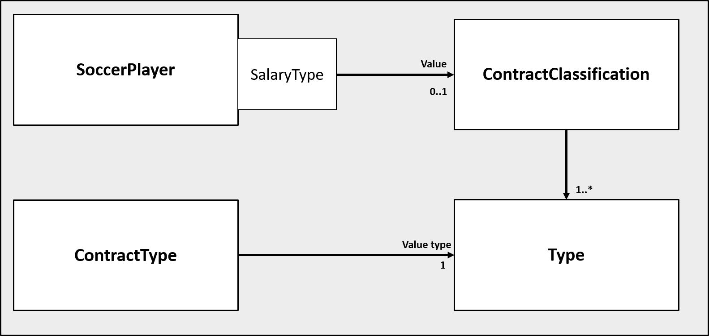

# Exercise "Implementing Properties"

## Basics on Property Modeling Approaches

The following two figures show two different problems in modeling dynamic properties. Interpret each figure and try to identify which property type is modeled.  

## Implementing the core API of the property pattern

### -- Preperations --

Please download the following `.zip`-File. It provides the basic structure of a Java Project implementing the concepts of the property pattern. Import/open the project in your favorite Java IDE (e.g. IntelliJ, Eclipse).

[implementing-properties](https://)

1. Try to get familiar with the class structure provided by the project. Try to understand the different relationships. Especially take a look at the class `HashMapProperties.java` which represents a concrete implementation of a Property List. It implements the Interface `Properties` which provides the core API of the Property Pattern.  

2. Class `HashMapProperties.java`: Implement the `put`-Method to add new properties to the HashMap.  

Hints: 
* Remind yourself that there can be a link to a parent HashMap (`PARENT`). Make sure the new value doesn't take it's value or doesn't match the Type of 'Properties'.
* Take a look at the `has`-Method - it is already implemented and can help you in understanding 

3. Class `HashMapProperties.java`: Implement the `get`-Method to retrieve a property by it's name from the HashMap.

Hint:
* Try to think about the two possible cases, where the given property can be located.

3. Adding a property to the project

4. Bonus: 

## Working with HashMaps

1. Run 
